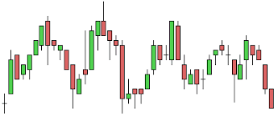

# Visualisation-de-données

### CandleStick chart ou Chandeliers japonais.

C’est un type de graphique utilisé en analyse technique boursière pour représenter les variations d'un cours. L'analyse d'un graphique en chandeliers sur une période passée est supposée donner des indications sur le cours futur.

### La bougie
L'évolution pendant une période élémentaire est représentée par un chandelier. Celui-ci est constitué ainsi :

un rectangle vertical, de largeur fixe, joint le cours d'ouverture au cours de fermeture ; il est coloré en noir (ou en rouge) si le cours de clôture est inférieur au cours d'ouverture, en blanc (ou en vert) dans le cas contraire ;
un trait fin vertical joint le cours le plus haut avec le sommet du rectangle (niveau de l'ouverture pour une bougie baissière, la clôture pour une haussière)
un trait fin vertical joint le cours le plus bas avec la base du rectangle (niveau de la clôture pour une bougie baissière, l'ouverture pour une haussière)
Le rectangle est la bougie et les deux traits aux extrémités sont les mèches ou les ombres.

Les chandeliers présentant une bougie bien marquée (longue bougie par rapport aux mèches) signifient une hausse ou une baisse (durant la période de temps considérée) selon que la couleur de leur corps est blanche ou noire (verte ou rouge pour les graphes en couleur).

Si les chandeliers japonais s’appellent chandeliers « japonais », c’est tout simplement parce que ce sont les japonais, qui, aux 17ème siècle les ont utilisés en premier. L’objectif était à l’époque d’anticiper les mouvements des prix du marché du riz.

Pour construire un chandelier japonais, nous avons besoin de quatre informations :

* Le prix d’ouverture
* Le prix de clôture
* Le prix le plus haut atteint sur la journée
* Le prix le plus bas atteint sur la journée

A partir de ces informations, on donnera une couleur au chandelier :

* Si le prix de clôture est supérieur au prix d’ouverture, le prix de l’action a donc progressé sur la journée : la bougie sera verte.
* Si le prix de clôture est inférieur au prix d’ouverture, le prix de l’action a donc diminué sur la journée : la bougie sera rouge.

<table border="0">
  <tr>
    <td>
      
    </td>
  </tr>
</table>

Par contre les chandeliers appelés toupie qui caractérisent par une bougie de petite taille comparé à leur mèche ont une interprétation plus complexe. D'abord cette petite bougie signifie un cours de clôture proche du cours d'ouverture, donc une séance hésitante équilibrée entre haussiers et baissiers. Sa signification dépend du contexte.

### Première interprétation

Le principal intérêt des chandeliers japonais est d’observer des séquences de plusieurs chandeliers japonais. Il est cependant possible d’interpréter les chandeliers japonais « seuls ».

Si la bougie est verte : la journée a été positive, nous sommes donc dans une séquence haussière de court-terme. La hausse devrait continuer le lendemain.

Si la bougie est rouge : la journée a été négative, nous sommes donc dans une séquence baissière de court-terme. La baisse devrait continuer le lendemain.

Plus le « corps » est grand (plus la différence entre le prix d’ouverture et de clôture est grande) et plus cette tendance est marquée.

A noter que le corps peut-être invisible quand le prix d’ouverture et de clôture sont le même (ou très proches), on parle de « doji ».

Nous pouvons ensuite analyser la mèche :

* Si la mèche supérieur est grande, cela veut dire que le prix est monté haut avant de descendre. On a donc une pression à la baisse.
* Si la mèche inférieure est grande, cela veut dire que le prix est descendu très bas avant de remonter. On a donc une pression à la hausse.
* L’absence de mèche accentuera une tendance haussière (verte) ou une tendance baissière (rouge)

### Applications

Il existe ne nombreuses manières de représenter le prix d’une action sur un graphique. Les chandeliers japonais en sont l’une des plus populaires, si ce n’est la plus populaire.  Et ce, pour une raison simple : les chandeliers japonais sont très riches en information (surtout par rapport aux simples courbes de prix).

<table border="0">
  <tr>
    <td>
      
    </td>
  </tr>
</table>

<table border="0">
  <tr>
    <td>
      
    </td>
  </tr>
</table>

### Réferences

https://fr.wikipedia.org/wiki/Chandeliers_japonais#/media/File:Chandelier_japonais_d%C3%A9finition.svg

https://www.abcbourse.com/apprendre/10_intro_chandeliers.html

https://www.tradingsat.com/guide-boursier/les-chandeliers-japonais-16/formes-et-significations-0/
